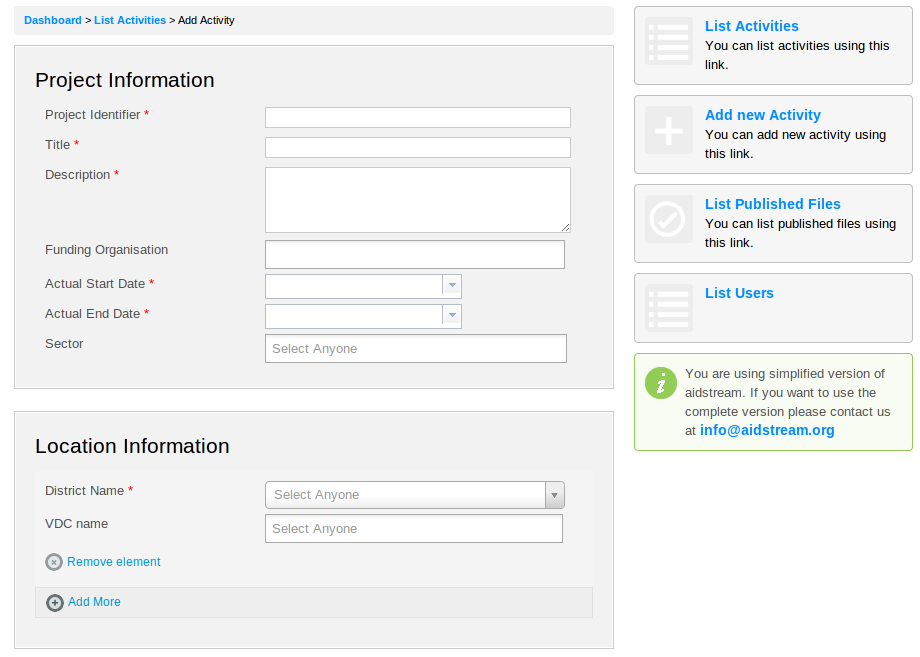
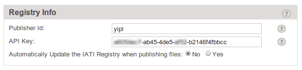
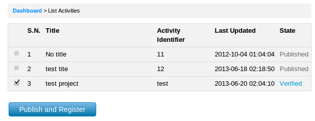
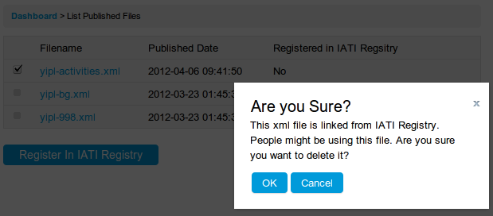

## Registration
Register at [www.aidstream.org](http://www.aidstream.org/user/user/register). However, you would have to additionally inform us at info@aidstream.org to have a simplified AidStream account.

Please contact us with the following details at info@aidstream.org:

- Organisation Info
	- Name of Organisation
	- Organisation Address
	- Account Identifier
		- A short abbreviation that uniquely identifies your organisation in Simplified AidStream
e.g. if you organisation is AidInfo, suggested account identifier is ai
All the users in Simplified AidStream will have Account Identifier as prefix, so that the usernames follow the standards]

- User info
	- Name
	- Email
		- For newly registered user, the user identifier will be admin, and the username will be ai_admin

## Data Entry

### Dashboard
Dashboard gives the overview of the activities.

 

### Settings
**Settings** allows to update defaults IATI values, organisation related information. The followings are covered in this section.

- Reporting Organisation Info
- Publishing Type
- Registry Info
- Default Field Values

#### Settings - Reporting Organisation
The **Reporting Organisation** is a mandatory field which clearly identifies the organisation that is publishing the data. All activities recorded in an AidStream account must contain the same Reporting Organisation. The Reporting Organisation may report data on activities funded and/or implemented by different organisations. 

As per IATI Standard, the following information is needed for the Reporting Organisation field.

- Reporting Organisation Identifier
- Reporting Organisation Type
- Reporting Organisation Name
- Reporting Organisation Language - Optional

##### Settings - Reporting Organisation Identifier
IATI requires each organisation to be referenced by a globally unique identifier. Some organisations may already have a code assigned to them in CRS. These codes can be found [Organisation Codelist](http://iatistandard.org/codelists/organisation)

However, many organisations will not have an existing code and one will need to be generated by the organisation for the purpose of IATI. This is done using a three-part key consisting of the followings

- Country
	- The country is the 3166-1 alpha-2 code for the country in which the registration agency is based. See [Country Codelist](http://iatistandard.org/codelists/country) for the codes.
- Registration agency
	- The registration agency is a code for a recognised agency that registers organisations. Eg. in the UK,there are three registration agencies: Companies House, the Charities Commissioner, and Revenue & Customs. Use their initials. 
- Registration number  
	- The registration number is the identifier issued by the relevant agency. Eg Oxfam-GB's identifier is GB-CHC-202918-LACA34 where GB-CHC refers to the UK Charity Commissioners)

##### Settings - Reporting Organisation Type
The type of organisation that best describes the Reporting Organisation. As per [Organisation Type Codelist](http://iatistandard.org/codelists/organisation_type), choose one from the following that identifies your organisation. 

- Government
- Other Public Sector
- International NGO
- National NGO
- Regional NGO
- Public Private Partnership
- Multilateral
- Foundation
- Private Sector
- Academic, Training and Research

#### Settings - Publishing Type
Selecting unsegmented publishing type will publish all your activities into one file whereas segmented allows the files to be published country wise.

#### Settings - Registry Info
Simplified AidStream will automatically register your published data on the IATI Registry. To do this it requires two pieces of information - Publisher Id and API Key.
 

##### Settings - Registry Info - Publisher Id
Register into IATI registry and create a new Publisher. When you create a new Publisher in [IATI Registry](http://iatiregistry.org), you will have to fill up a form that includes **publisher id** - which is also required in AidStream to register automatically in the IATI Registry. You may also choose to do the register manually in the IATI Registry.

##### Settings - Registry Info - API Key
If you click on **My account** in IATI Registry, you should see **API Key** for use in AidStream.

By default, **Automatically update the IATI Registry when publishing files** is set to No. It means that when you publish files in Simplified AidStream, IATI XML files will be created but you will have to click **Register with IATI Registry** under **List Published Files** to register your XML files with IATI Registry. This option helps to create publish XML files without having to create account in IATI Registry.

By default, **Automatically update the IATI Registry when publishing files** is set to **No**. It means that when you publish files in AidStream, IATI XML files will be created but you will have to  click **Register with IATI Registry** under **List Published Files** to register your XML files with IATI Registry. This option helps to create publish XML files without having to create account in IATI Registry.

#### Settings - Default Field Values

There are a number of pieces of information that remain the same for all your activities. By entering them in **Default Field Values** you will not have to re-enter them each time you enter a new activity. Enter only the mandatory field such as Default Currency and Default Language. The other fields would be useful only in the later phase.

### List Users

The users who have been created will be listed here.

While **adding users**, in the username field, appropriate name such as Chris, Dale can be entered and the account username for Chris would be account-identifier_Chris

### Add new activity

Data can be entered to various field under different sections such as project information, location information, budget information etc. As you enter the data and save it, a new activity will be created. This activity can be viewed from **List Activities** section. Further changes can be made to the activity from **Edit this activity**.

### Simplified Aidstream Activity States

Simplified AidStream maintains a simple workflow to ensure that the activities are properly verified before it gets registered in IATI Registry for public view. The following states are maintained in the activities.
- Edit
- Completed
- Verified
- Published
When the activity is in any one of the states, any further changes in the activity will return its state back to **Editing**. The entire flow has to be followed before the changes gets updated in the activity xml files and registered in IATI Registry. It is recommended that different users are given access to each of these roles for the workflow.

## Publishing of Activities

You may publish the activities only when it is **Checked**. As you may see below, the **Checked** activity only is applicable for publishing. Clicking **Publish** will generate XML file(s) with the checked activity along with those activities in published state.

### Registering with IATI Registry

Please see the **Settings - Registry Info** for required information before registering with IATI Registry. If you have set above option to **No**,

Clicking on **Publish** button will create the XML files. You will then get the option to **Register your published files in IATI Registry** from List Published Files

If you have set **Auto register with IATI Registry** to **Yes** in Settings as shown below, Publish action will generate the XML files and also register them with the IATI Registry.

Activities list will allow to generate XML file(s) and register with IATI Registry. Also, you may see the published xml files in **List Published Files** but the **Register with IATI Registry** will be disabled as shown below.

When you publish files for the first time and register with the IATI Registry, you will not see **Delete**. However when you change the **Publishing type** from Segmented to Unsegmented or vice versa, there will both types of files - Segmented as well as Unsegmented. **Delete** option will allow you to delete the files in that case, however care needs to be taken as the files which are registered in IATI Registry may be in use by third party applications.
E.g. you may see below there are segmented files viz yipl-bg.xml and yipl-998.xml as well as unsegemented file viz. yipl-activities.xml, after changing **Publishing type** from Segmented to Unsegmented. **Delete** link appears now, however it gives alerts before deleting the files from the server.

Clicking **Delete** will alert you with the following message for the IATI Registry linked files.

